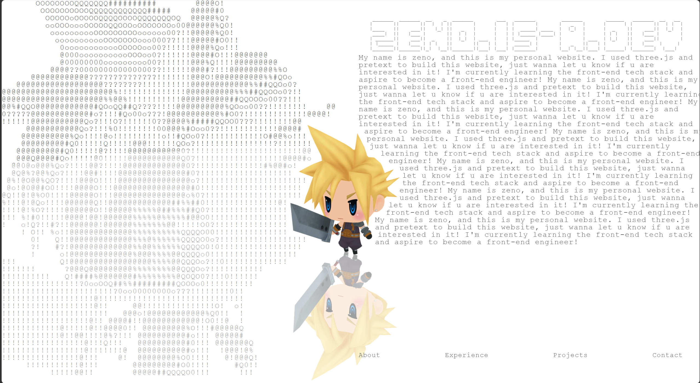

<div align="center">
  
  <h1>zenosite</h1>
  <p><sub>ASCII-styled 3D Cloud Personal Website</sub></p>
</div>

这是一个交互式个人主页项目，使用 Vue 3、TypeScript、Three.js、Pretext、GSAP 和自定义 ASCII 渲染层构建。

网站以全屏 3D 场景为核心，包含响应式导航、页面切换动画、ASCII 风格文本排版，以及移动端适配的联系入口。

ASCII动态背景来自Pretext仓库的官方demo: variable-typographic-ascii
3D模型来自sketchfab/@Robduc.

目前网站已经部署到了[zeno.is-a.dev](https://zeno.is-a.dev)

## 预览



你也可以点击[这里](https://zeno.is-a.dev)直接访问预览。

## 技术栈

- Vue 3
- Vue Router
- TypeScript
- Vite
- Three.js
- GSAP
- @chenglou/pretext

## 如何修改内容

日常改网站内容时，主要看这两个目录：

- `src/content/`：修改页面文本、项目介绍、社交徽章和联系方式。
- `src/config/`：修改相机、布局、断点、ASCII 显示参数等配置。

### 修改页面文字

页面文案集中在 `src/content/siteContent.ts`。

这里可以修改：

- `about`：关于我页面的文本、技术栈徽章、社交徽章。
- `experience`：经历页面的文本。
- `projects`：项目页面的文本。
- `contact`：联系页面的文本和联系方式。

常用字段说明：

- `lines`：页面上显示的 ASCII 文本内容。
- `badges`：技术栈徽章图片链接。
- `badgeAnchorLineIndex`：技术栈徽章插入到哪一行附近。
- `socialBadges`：社交徽章，支持跳转链接或复制文本。
- `socialBadgeAnchorLineIndex`：社交徽章插入到哪一行附近。
- `scrollable`：页面内容较长时是否允许滚动。

### 修改配置

配置文件集中在 `src/config/`。

- `src/config/ascii.ts`：ASCII 字符尺寸、缩放、偏移、文字避让模型的参数。
- `src/config/layout.ts`：首页和子页面的文字布局、边距、字号范围、对齐方式。
- `src/config/camera.ts`：3D 相机视角、环绕速度、页面切换时的相机位置。
- `src/config/breakpoints.ts`：响应式断点和移动端判断逻辑。

如果只是改文字，优先改 `src/content/siteContent.ts`。
如果要调整文字位置、大小、相机角度、移动端适配，再改 `src/config/` 里的文件。

## 项目结构

```text
src/
  assets/          静态样式和 3D 模型资源
  config/          相机、布局、断点、ASCII 显示配置
  content/         页面文案、项目介绍、徽章和联系方式
  router/          路由定义和页面配置
  scene/           Three.js 场景、ASCII 渲染、布局和动画运行时
  state/           共享导航状态
  views/           Vue 页面级组件
```

## 本地运行

安装依赖：

```sh
npm install
```

启动开发服务器：

```sh
npm run dev
```

构建生产版本：

```sh
npm run build
```

本地预览生产构建：

```sh
npm run preview
```

## 部署

这是一个静态 Vite 应用，生产构建产物会输出到 `dist/`。

`public/_redirects` 用于在 Netlify 这类静态托管平台上支持 SPA fallback 路由。

## 备注

- 3D 模型文件位于 `src/assets/models/cloud-from-world-of-final-fantasy.glb`。
- 个人介绍、项目描述、社交徽章链接位于 `src/content/siteContent.ts`。
- 项目在 `package.json` 中标记为 `private`，用于避免误发布到 npm；这不会影响 GitHub 仓库公开。
